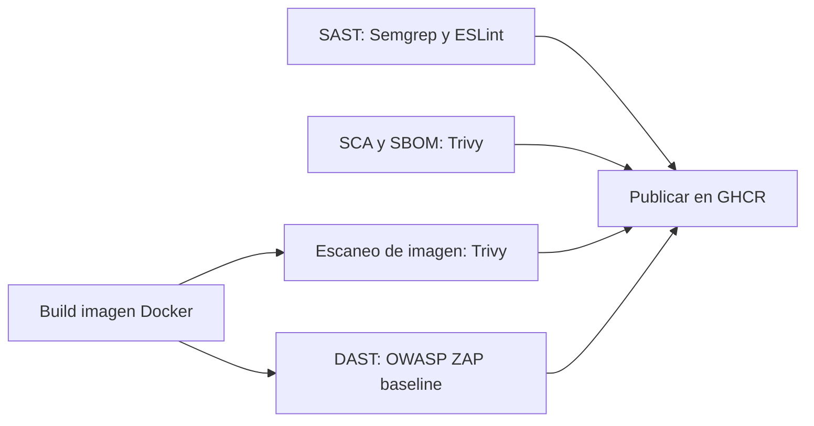

# euVWA - Pipeline DevSecOps (Actividad 2)

> **Aviso importante.** euVWA es una aplicacion **deliberadamente vulnerable**. La rama `main-vulnerable` contiene fallos de seguridad reales y explotables. No la despliegues en produccion ni la expongas a internet. Usala solo en local o en entornos de laboratorio controlados.

Autor: Oussama Marzak Faroit. Universidad Europea. Asignatura: Desarrollo Seguro de Web y Apps.

---

## 1. Resumen del proyecto

Partiendo de la aplicacion euVWA de la Actividad 1 (Node.js y Express, inspirada en DVWA), en esta Actividad 2 se construye un **pipeline completo de DevSecOps** que integra controles de seguridad automatizados desde el desarrollo hasta el despliegue, siguiendo el enfoque Shift Left.

El repositorio mantiene dos ramas paralelas con el mismo conjunto de funcionalidades:

- **`main-vulnerable`**: contiene 9 vulnerabilidades del OWASP Top 10 y una dependencia con CVE conocido. Su pipeline esta disenado para **detectar, reportar y bloquear**, de modo que falla y no publica ninguna imagen.
- **`main-secure`**: implementa las mismas funcionalidades de forma segura. Su pipeline **supera todos los controles** y publica la imagen en GitHub Container Registry.

Cada rama tiene su propio workflow (`.github/workflows/devsecops-secure.yml` y `.github/workflows/devsecops-vulnerable.yml`), de manera que se aprecian como dos versiones independientes del pipeline.

---

## 2. Arquitectura del pipeline

El pipeline se compone de seis trabajos encadenados por dependencias:



Los analisis (SAST, SCA y build) se ejecutan en paralelo. El escaneo de imagen y el DAST dependen del build. La publicacion solo ocurre si todos los controles anteriores pasan, y unicamente en la rama segura.

---

## 3. Explicacion de cada control y su proposito de seguridad

### 3.1. SAST (analisis estatico de codigo)
Herramientas: **Semgrep** y **ESLint** con `eslint-plugin-security`.
- Proposito: detectar patrones inseguros en el codigo fuente sin ejecutarlo, lo antes posible en el ciclo (Shift Left).
- En euVWA detecta la inyeccion SQL por concatenacion (`tainted-sql-string`), el secreto de sesion incrustado en el codigo (`express-session-hardcoded-secret`) y la inyeccion de comandos (`detect-child-process` con `exec` y argumento no literal).
- El gate de ESLint bloquea ante el uso de `child_process.exec` con entrada no literal. El gate de Semgrep cuenta los hallazgos reales y excluye las reglas informativas (las que detectan buenas practicas como helmet o el rate limiting) y los avisos de cookie de bajo riesgo en un entorno sin HTTPS.

### 3.2. SCA y SBOM (analisis de dependencias e inventario de software)
Herramienta: **Trivy**.
- Proposito: identificar dependencias con vulnerabilidades conocidas y generar el inventario de componentes (SBOM).
- El SBOM se genera en formato **CycloneDX** (100 componentes en la rama segura).
- El gate falla ante vulnerabilidades **CRITICAL** o **HIGH** con parche disponible (`--ignore-unfixed`).

### 3.3. Build de la imagen Docker
- Construye la imagen endurecida descrita en el apartado 4 y la exporta como artefacto para los trabajos siguientes.

### 3.4. Escaneo de la imagen Docker
Herramienta: **Trivy** (modo imagen).
- Proposito: detectar vulnerabilidades en las capas de la imagen final, no solo en el codigo.
- Mismo umbral que el SCA: bloquea ante CRITICAL o HIGH con parche.

### 3.5. DAST (analisis dinamico)
Herramienta: **OWASP ZAP** en modo baseline.
- Proposito: atacar la aplicacion en ejecucion para detectar fallos visibles en tiempo de ejecucion (cabeceras de seguridad ausentes, cookies inseguras, fuga de informacion).
- La aplicacion se levanta en un contenedor y ZAP se ejecuta en la misma red Docker para alcanzarla por su nombre de servicio.
- El gate bloquea ante alertas de **riesgo alto**. Las de riesgo medio y bajo quedan registradas como evidencia en el informe.

### 3.6. Publicacion en GHCR
- Solo se ejecuta si SAST, SCA, escaneo de imagen y DAST pasan, y solo en la rama segura.
- Publica la imagen en `ghcr.io/omarzakuem19/euvwa-devsecops` con las etiquetas de rama y de commit. Asi se garantiza que nunca se publica una imagen que no haya superado los controles.

---

## 4. Hardening de la imagen Docker (justificacion)

El `Dockerfile` aplica las siguientes medidas, iguales en las dos ramas porque el endurecimiento del contenedor es independiente del codigo:

| Medida | Justificacion |
|---|---|
| Imagen base `node:20-alpine` | Imagen minima, con mucha menos superficie de ataque que una imagen completa. |
| Construccion **multi-stage** | La imagen final no arrastra la cache de npm ni las dependencias de desarrollo. |
| `npm ci --omit=dev --ignore-scripts` | Instalacion reproducible, solo de produccion y sin ejecutar scripts de post instalacion, que es un vector de ejecucion de codigo en el build. |
| Usuario **no root** (`node`, uid 1000) y `COPY --chown` | El proceso se ejecuta sin privilegios y ningun archivo pertenece a root. |
| **Eliminacion de npm, npx y yarn** del runtime | La aplicacion solo necesita `node`. Quitar estas herramientas elimina los CVE de sus dependencias internas (cross-spawn, glob, minimatch, tar) y reduce la superficie de ataque. |
| `NODE_ENV=production` | Configuracion de produccion de Express. |
| **Sin secretos en la imagen** | El `SESSION_SECRET` se inyecta como variable de entorno en tiempo de ejecucion, no se hornea en la imagen. |
| `HEALTHCHECK` | Permite que el orquestador conozca el estado de salud del contenedor. |
| `.dockerignore` | Deja fuera del contexto de build el control de versiones, los datos, las subidas y la documentacion. |

---

## 5. Umbrales de severidad y politica de gates

| Control | Umbral que bloquea |
|---|---|
| SAST (ESLint) | Uso de `child_process.exec` con entrada no literal (inyeccion de comandos). |
| SAST (Semgrep) | Hallazgos reales, excluyendo reglas informativas `good_` y avisos de cookie de bajo riesgo. |
| SCA (dependencias) | Vulnerabilidades CRITICAL o HIGH con parche disponible. |
| Escaneo de imagen | Vulnerabilidades CRITICAL o HIGH con parche disponible. |
| DAST (ZAP) | Alertas de riesgo alto. |
| Publicacion | Solo si todos los gates anteriores pasan. |

El archivo `.trivyignore` queda preparado para documentar, de forma justificada y con fecha de revision, las excepciones de dependencias base que se decidan aceptar. La dependencia introducida a proposito en la rama vulnerable nunca se anade a ese archivo.

---

## 6. Resultados de la ejecucion real

Datos obtenidos de las ejecuciones reales del pipeline en GitHub Actions.

| Control | `main-vulnerable` | `main-secure` |
|---|---|---|
| SAST | Falla (SQLi, secreto en codigo, inyeccion de comandos) | Pasa |
| Dependencias (Trivy) | Falla: 12 vulnerabilidades (lodash 1 CRITICAL y 4 HIGH, multer 7 HIGH) | Pasa: 0 |
| Build | Construye | Construye |
| Escaneo de imagen | Falla: 1 CRITICAL y 11 HIGH | Pasa: 0 |
| DAST (ZAP) | 14 alertas (3 medias, 6 bajas, 5 informativas) | 10 alertas (3 medias, 2 bajas, 5 informativas), 0 altas |
| Publicacion | No se ejecuta | Publica la imagen en GHCR |
| **Resultado global** | **Falla y bloquea el despliegue** | **Pasa y publica** |

El contraste del DAST refleja el hardening de cabeceras y cookies: la rama segura usa `helmet` y cookie con `HttpOnly` y `SameSite`, por lo que ZAP reporta menos alertas de bajo riesgo. El bloqueo efectivo de la rama vulnerable lo provocan el SAST, el analisis de dependencias y el escaneo de imagen.

---

## 7. Informes y artefactos

Cada ejecucion del pipeline guarda como artefactos descargables:

- `sast-reports-*`: informe de ESLint (JSON) y de Semgrep (SARIF). El SARIF tambien se sube a la pestana Security del repositorio (Code scanning).
- `sca-sbom-*`: el **SBOM** en formato CycloneDX (`sbom.cdx.json`) y el informe de dependencias de Trivy.
- `image-scan-*`: informe de vulnerabilidades de la imagen.
- `dast-reports-*`: informe de OWASP ZAP en HTML, JSON y Markdown.

La imagen publicada esta disponible en `ghcr.io/omarzakuem19/euvwa-devsecops`.

---

## 8. Como reproducir

### Ejecutar la aplicacion en local
```bash
git checkout main-secure   # o main-vulnerable
npm install
npm run seed
npm start
```
La aplicacion queda en `http://localhost:3000`. Usuarios de prueba: `admin / admin` y `user / user`.

### Ejecutar el pipeline
El pipeline se dispara de forma automatica con cada push o pull request a las ramas `main-secure` y `main-vulnerable`, y tambien se puede lanzar a mano desde la pestana Actions (workflow_dispatch).

---

## 9. Propuestas de mejora

- Anadir un escaneo DAST en modo full (activo), ademas del baseline, para detectar inyecciones explotables en tiempo de ejecucion.
- Firmar la imagen publicada con cosign y verificar la firma antes del despliegue.
- Fijar por digest las imagenes base y las versiones de las acciones de GitHub.
- Actualizar las acciones a Node 24 cuando sea obligatorio.
- Anadir pruebas automatizadas y medir cobertura como parte del pipeline.
- Revisar de forma periodica el archivo `.trivyignore` y las excepciones aceptadas.

---

## 10. Las dos ramas y las vulnerabilidades de la Actividad 1

| Nº | Vulnerabilidad | Ruta | Correccion en `main-secure` |
|----|----------------|------|------------------------------|
| 1 | SQL Injection | `/login` | Consulta parametrizada y `bcrypt.compare`. |
| 2 | Reflected XSS | `/search` | Escape automatico de EJS con `<%= %>`. |
| 3 | Stored XSS | `/guestbook` | Render con escape automatico. |
| 4 | Command Injection | `/tools/ping` | `execFile` sin shell y validacion del host. |
| 5 | Insecure File Upload | `/profile/avatar` | Whitelist de extensiones, comprobacion de MIME y renombrado aleatorio. |
| 6 | Broken Authentication | `/login` | `bcrypt`, secret desde `.env`, cookie `HttpOnly` y rate limit. |
| 7 | Broken Access Control (IDOR) | `/users/:id` | Comprobacion de propietario o rol admin. |
| 8 | Security Misconfiguration | `/debug/error` | `helmet`, sin `X-Powered-By` y manejo de errores generico. |
| 9 | Sensitive Data Exposure | `/debug` | Acceso restringido a admin y solo metadatos no sensibles. |

Las evidencias de explotacion estan en `docs/evidence/vulnerable/`.
